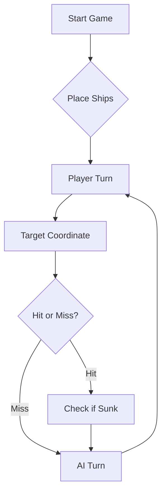

Gravação do jogo a funcionar: https://youtu.be/MdS-tlItD_Q
Gravação do jogo do LLM: https://youtu.be/77TVOWuy2M4

Prompt do LLM: Vais jogar Batalha Naval dos Descobrimentos contra um adversário humano.
O tabuleiro tem linhas A–J e colunas 1–10.

A frota inimiga (oculta) é composta por 11 navios:
- 4 Barcas (1 célula)
- 3 Caravelas (2 células, linha reta)
- 2 Naus (3 células, linha reta)
- 1 Fragata (4 células, linha reta)
- 1 Galeão (5 células, forma de T: corpo de 3 células + 1 asa em cada lado de uma extremidade)

Os navios nunca se tocam, nem nas diagonais.

O humano responde a cada rajada com um JSON no seguinte formato:
{
  "validShots": N,
  "sunkBoats": [{"count": N, "type": "TipoNavio"}],
  "repeatedShots": N,
  "outsideShots": N,
  "hitsOnBoats": [{"hits": N, "type": "TipoNavio"}],
  "missedShots": N
}

Cada rajada tem exactamente 3 tiros, no formato: rajada X0 X0 X0
(ex: rajada B2 F7 J10)

============================
REGRAS ESTRATÉGICAS OBRIGATÓRIAS
============================

1. DIÁRIO DE BORDO
   Mantém internamente um registo completo de todos os tiros já disparados,
   organizado por rajada. Para cada célula regista: coordenada + resultado
   (Água, Atingido-TipoNavio, Afundado-TipoNavio). NUNCA dispares para uma
   célula já registada no diário (salvo na última rajada do jogo, apenas para
   perfazer os 3 tiros obrigatórios quando todos os navios já estiverem afundados).

2. VARREDURA INICIAL EM PADRÃO DE XADREZ
   Enquanto não houver navios atingidos por confirmar, usa um padrão de xadrez
   (células onde (linha_índice + coluna) é par, ou seja, B2, B4, B6... D1, D3...)
   para cobrir o máximo de área com o mínimo de tiros. Qualquer navio com 2+
   células será sempre atingido por pelo menos um tiro neste padrão.

3. CAÇA APÓS TIRO CERTEIRO
   Se uma rajada reportar hitsOnBoats > 0 para um navio ainda não afundado,
   na rajada seguinte dispara para as 4 direcções cardeais (N, S, E, O) da célula
   atingida (apenas as que ainda não foram testadas). Isto permite determinar a
   orientação do navio e completar o afundamento.

4. APROVEITAMENTO DAS DIAGONAIS
   Após um tiro certeiro numa célula X, as 4 diagonais de X são garantidamente
   água (os navios não se tocam nas diagonais). Marca-as como água no diário e
   nunca as dispares. EXCEPÇÃO: o Galeão tem forma de T, pelo que as diagonais
   do corpo podem conter as asas.

5. HALO APÓS AFUNDAMENTO
   Quando um navio for confirmado afundado, identifica todas as suas células
   no diário e marca todo o perímetro adjacente (halo de 1 célula em redor)
   como água intransitável. Nunca dispares para esse halo.

6. NAVIOS LINEARES vs. GALEÃO
   - Caravelas, Naus e Fragatas são sempre linhas rectas (horizontal ou vertical).
     Após dois tiros certeiros, a orientação fica confirmada — continua nessa direcção.
   - O Galeão tem forma de T. Após localizar o corpo de 3 células, procura as 2 asas
     perpendiculares numa das extremidades. As 4 orientações possíveis do T são:
     asas a Norte, a Sul, a Este ou a Oeste (em relação ao braço livre do T).

7. PRIORIDADES
   Quando há múltiplos navios atingidos por confirmar, prioriza o maior (mais difícil
   de localizar por tentativa-e-erro). Dedica os 3 tiros da rajada a um único navio
   sempre que possível, para o afundar mais rapidamente.

8. SEM TIROS FORA DO TABULEIRO
   Linha válida: A–J. Coluna válida: 1–10. Nunca dispares para coordenadas
   fora deste intervalo (ex: K4, B11, A0).

Começa agora. Emite a primeira rajada e aguarda a resposta do adversário.
Após cada resposta JSON, actualiza o teu Diário de Bordo internamente,
aplica as regras estratégicas e emite a rajada seguinte.
Responde APENAS com o diário actualizado (resumido) e a nova rajada.

# ⚓ Battleship 2.0


> A modern take on the classic naval warfare game, designed for the XVII century setting with updated software engineering patterns.

---

## 📖 Table of Contents
- [Project Overview](#-project-overview)
- [Key Features](#-key-features)
- [Technical Stack](#-technical-stack)
- [Installation & Setup](#-installation--setup)
- [Code Architecture](#-code-architecture)
- [Roadmap](#-roadmap)
- [Contributing](#-contributing)

---

## 🎯 Project Overview
This project serves as a template and reference for students learning **Object-Oriented Programming (OOP)** and **Software Quality**. It simulates a battleship environment where players must strategically place ships and sink the enemy fleet.

### 🎮 The Rules
The game is played on a grid (typically 10x10). The coordinate system is defined as:

$$(x, y) \in \{0, \dots, 9\} \times \{0, \dots, 9\}$$

Hits are calculated based on the intersection of the shot vector and the ship's bounding box.

---

## ✨ Key Features
| Feature | Description | Status |
| :--- | :--- | :---: |
| **Grid System** | Flexible $N \times N$ board generation. | ✅ |
| **Ship Varieties** | Galleons, Frigates, and Brigantines (XVII Century theme). | ✅ |
| **AI Opponent** | Heuristic-based targeting system. | 🚧 |
| **Network Play** | Socket-based multiplayer. | ❌ |

---

## 🛠 Technical Stack
* **Language:** Java 17
* **Build Tool:** Maven / Gradle
* **Testing:** JUnit 5
* **Logging:** Log4j2

---

## 🚀 Installation & Setup

### Prerequisites
* JDK 17 or higher
* Git

### Step-by-Step
1. **Clone the repository:**
   ```bash
   git clone [https://github.com/britoeabreu/Battleship2.git](https://github.com/britoeabreu/Battleship2.git)
   ```
2. **Navigate to directory:**
   ```bash
   cd Battleship2
   ```
3. **Compile and Run:**
   ```bash
   javac Main.java && java Main
   ```

---

## 📚 Documentation

You can access the generated Javadoc here:

👉 [Battleship2 API Documentation](https://britoeabreu.github.io/Battleship2/)


### Core Logic
```java
public class Ship {
    private String name;
    private int size;
    private boolean isSunk;

    // TODO: Implement damage logic
    public void hit() {
        // Implementation here
    }
}
```

### Design Patterns Used:
- **Strategy Pattern:** For different AI difficulty levels.
- **Observer Pattern:** To update the UI when a ship is hit.
</details>

### Logic Flow


---

## 🗺 Roadmap
- [x] Basic grid implementation
- [x] Ship placement validation
- [ ] Add sound effects (SFX)
- [ ] Implement "Fog of War" mechanic
- [ ] **Multiplayer Integration** (High Priority)

---

## 🧪 Testing
We use high-coverage unit testing to ensure game stability. Run tests using:
```bash
mvn test
```

> [!TIP]
> Use the `-Dtest=ClassName` flag to run specific test suites during development.

---

## 🤝 Contributing
Contributions are what make the open-source community such an amazing place to learn, inspire, and create.

1. Fork the Project
2. Create your Feature Branch (`git checkout -b feature/AmazingFeature`)
3. Commit your Changes (`git commit -m 'Add some AmazingFeature'`)
4. Push to the Branch (`git push origin feature/AmazingFeature`)
5. Open a **Pull Request**

---

## 📄 License
Distributed under the MIT License. See `LICENSE` for more information.

---
**Maintained by:** [@britoeabreu](https://github.com/britoeabreu)  
*Created for the Software Engineering students at ISCTE-IUL.*
